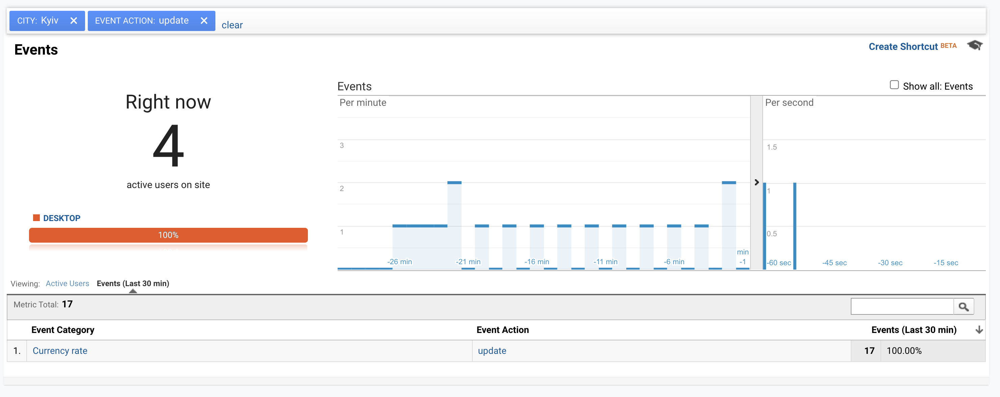

# Table of Contents

1.  [Common IDEA](#orgf9b2c75)
2.  [Current implementation](#orge867d56)
3.  [Execution](#org95b1119)


<a id="orgf9b2c75"></a>

# Common IDEA

Create client via GAMP (Google Analytic Measurement Protocol)


<a id="orge867d56"></a>

# Current implementation

We choose the python as the main language

Python has PyGAMP lib to send GA data


<a id="org95b1119"></a>

# Execution

`./send-currency.sh` will generate event each 120s (2 minutes) to send analytic as separate client to the predefined GA<sub>TRACKING</sub><sub>ID</sub>

1. Read call `https://bank.gov.ua/NBUStatService/v1/statdirectory/exchange?json&valcode=USD` API to read UAH / USD currency rate
2. Read currency rate and transform it to int value by formula `int(rate * 1000)`
3. Send currency rate to GA as event with 

``` python
data = {
    "category":   'Currency rate'
    "action":     'Update'
    "label":      'UAH/USD'
    }
```

The result and sent events could be seen on the Event page

