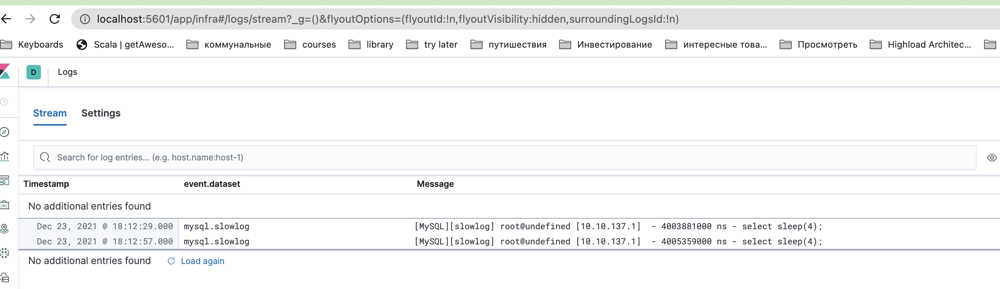
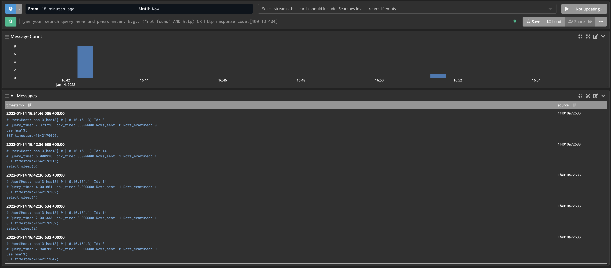

## MySQL (slow_query_log)  FileBeat +  ElasticSearch + Kibana  <-> FileBeat + Graylog


# Start

## Start ELK stack

``` shell 
docker-compose up -d --profile elk 
```

## Start Graylog stack

``` shell
docker-compose up -d --profile graylog
```

# Connect to database 

 - slow query log configuration [Slow log в MySQL](https://ruhighload.com/%D0%9A%D0%B0%D0%BA+%D0%B2%D0%BA%D0%BB%D1%8E%D1%87%D0%B8%D1%82%D1%8C+slow+log+%D0%B2+mysql%3F)
 
```
mycli -u <user from config> -p <password from config>
>> Select sleep(4);
>> Select sleep(4);
>> Select sleep(4);
```

# MySql logs

```
tail -f ./db/logs/mysql-slow.log
```

# Kibana

 - Display slow query log 
 
  
 
# Graylog 

 - Display slow query log
 
 
