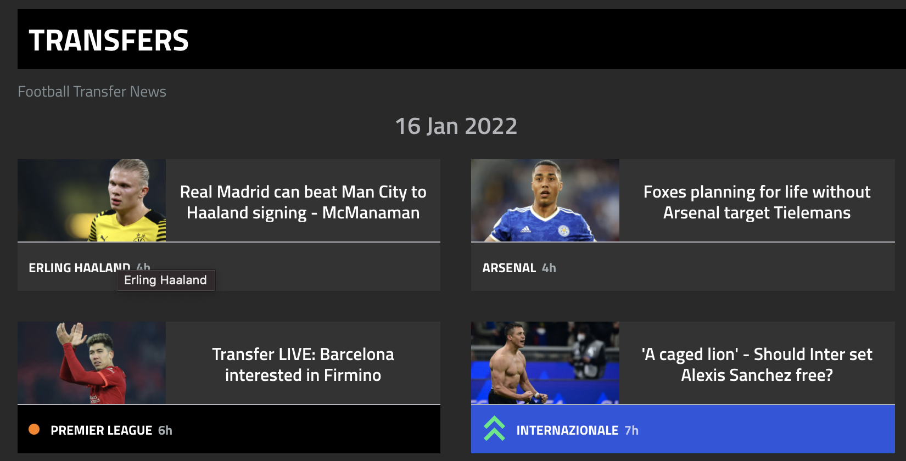

# Task

GOAL!!!

Describe solution that solves peak load problem for biggest european
football website <https://goal.com>

1.  Analyze all types of pages on the site
2.  Analyze and list possible sources of peak load
3.  Describe possible solution for each type

# Page types

## Static content

All of described below are static pages with content, which shouldn\'t
make load on the back-end side 

-   News page
-   Players information
-   Last clubs\' news and information
-   Match history results

## Shop Page

It\'s possible place of the load but we can\'t expect peak load here
according to the site specialization mostly provide information about
sport translations and sport news

## Live scores

Page contains live results of current matches. 

It\'s possible due to the permanent polling process, which triggers
back-end each period of time (currently seen - 30 seconds) 

## Live blog pages

Pages with static content but user frequently to show updated news

# Possible peak load

## Live score page

According to the permanent asking back-end part for refreshed
information

## Live blog pages

According to the need of actualization and user action permanent refresh

## Concurrent resources usage

During popular match with big audience our services could feel high
load. Regular, it\'s related to the specific region but some matches
could have wider audience so all servers will bu under the load

# Describe possible solution for each type

1.  We must be prepared for the peaks when we can. Add auxiliary
    resources during predicted load peaks. We could be sure that popular
    match will lead to the new load
2.  We must gather resources in specific area if match is local
3.  We must cache data via CDN to have faster access to the same data in
    the region
