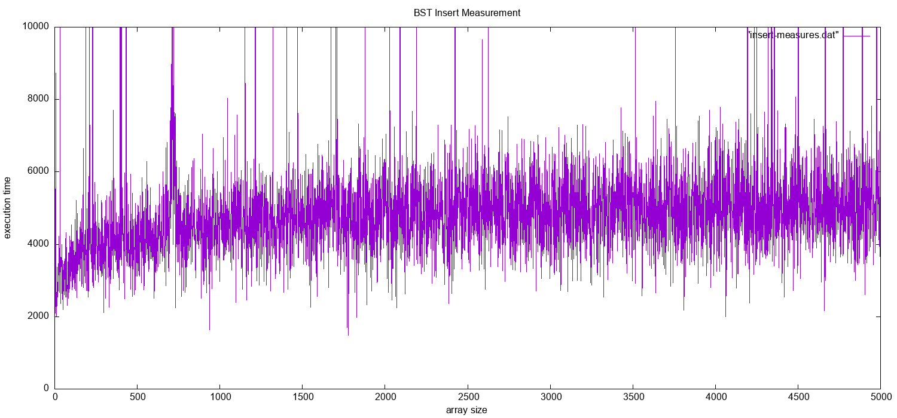
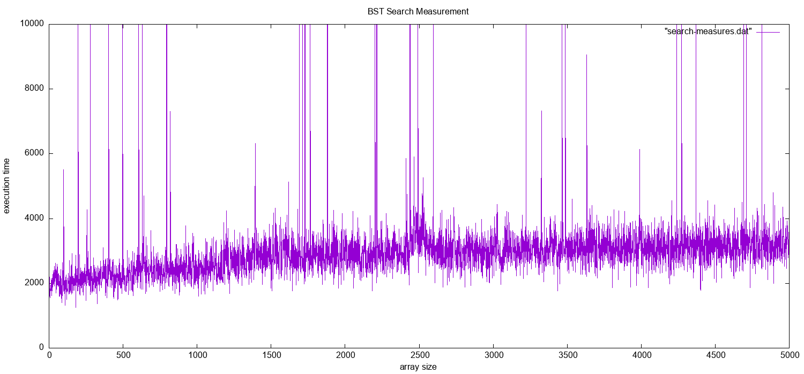
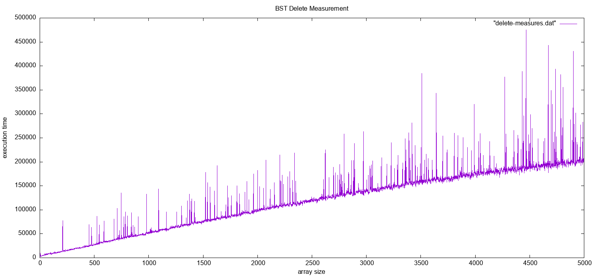

# Algorithm implementation

## BST \[0/3\] :file \`BST.worksheet.sc\`


## Counting Sort

# Tests algorithm

## BST measures

### Insert

1.  Gen data file for random data insertion

    ``` python
    from bst import *
    from random import randint
    import time
    import sys

    print("Insert measurement")

    dataSetSize = 5000
    file_object = open("insert-measures.dat", "w")
    file_object.write("# array_size time\n")
    for size in range(1, dataSetSize):
        bst = BST(0)

        for i in range(0, size):
            bst.insert(randint(1, dataSetSize))

        start = time.perf_counter_ns()
        bst.insert(randint(1, dataSetSize))
        end = time.perf_counter_ns()
        file_object.write("{} {}\n".format(size, end - start))

    file_object.close()
    ```

2.  Show result (requires \`gnuplot\`)

    Script saves result to the \`bst-insert-measurement.png\` file

    ``` shell
    gnuplot bst-insert.p
    open bst-insert-measurement.png
    ```

    

### Search

1.  Gen data file

    ``` python
    from bst import *
    from random import randint
    import time

    print("Search measurement")
    dataSetSize = 5000
    file_object = open('search-measures.dat', 'w')
    file_data = []
    file_data.append("# array_size time\n")
    for size in range(1, dataSetSize):
        bst = BST(0)
        for i in range(0, size):
            bst.insert(randint(1, dataSetSize))

        start = time.perf_counter_ns()
        bst.find(randint(1, dataSetSize))
        end = time.perf_counter_ns()
        file_data.append("{} {}\n".format(size, end - start))

    file_object.write(''.join(file_data))
    file_object.close()
    ```

2.  Show result (requires \`gnuplot\`)

    Script saves result to the \`bst-search-measurement.png\` file

    ``` shell
    gnuplot bst-search.p
    open bst-search-measurement.png
    ```

    

### Delete

1.  Gen data file

    ``` python
    from bst import *
    from random import randint
    import time

    print("Delete measurement")
    dataSetSize = 1000
    file_object = open("delete-measures.dat", "w")
    file_object.write("# array_size time\n")
    for size in range(1, dataSetSize):
        bst = BST(0)
        for i in range(0, size):
            bst.insert(randint(1, dataSetSize))

        start = time.perf_counter_ns()
        bst.delete(randint(1, dataSetSize))
        end = time.perf_counter_ns()
        file_object.write("{} {}\n".format(size, end - start))

    file_object.close()
    ```

2.  Show result (requires \`gnuplot\`)

    Script saves result to the \`bst-delete-measurement.png\` file

    ``` shell
    gnuplot bst-delete.p
    open bst-delete-measurement.png
    ```

    
