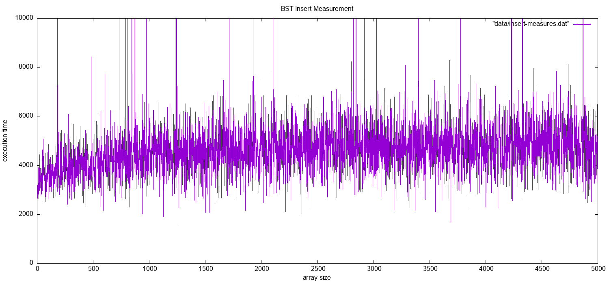
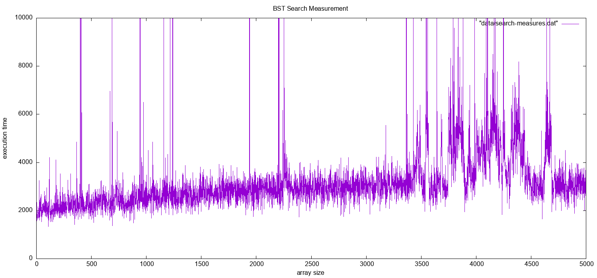
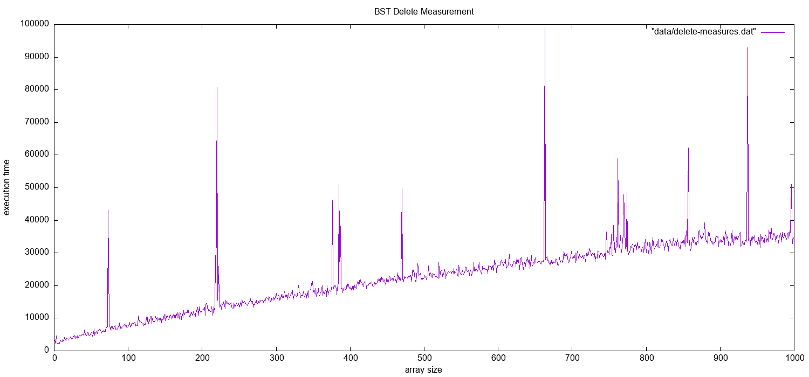
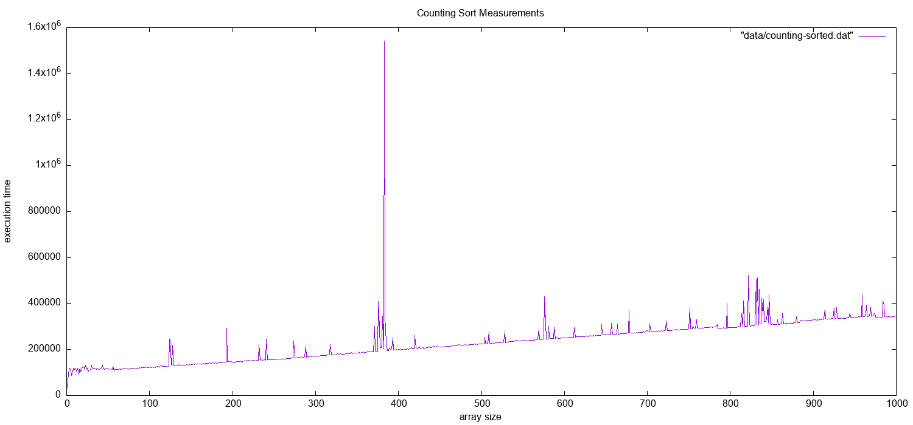
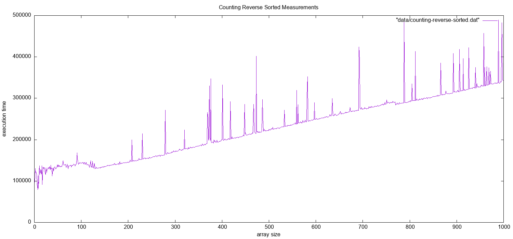
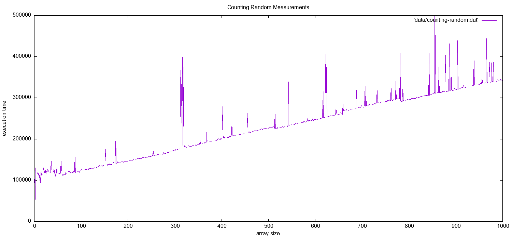

# Algorithm implementation

## BST \[0/3\] :file \`BST.worksheet.sc\`

### \[x\] insert

### \[x\] find

### \[x\] delete

## Counting Sort

# Tests algorithm

## BST measures

### Insert

1.  Gen data file for random data insertion

    ``` python
    from impl.bst import *
    from random import randint
    import time
    import os

    print("Insert measurement")

    dataSetSize = 5000

    filename = os.path.join(os.path.dirname(__file__), "./data/insert-measures.dat")
    file_object = open(filename, "w")

    file_object.write("# array_size time\n")
    for size in range(1, dataSetSize):
        bst = BST(0)

        for i in range(0, size):
            bst.insert(randint(1, dataSetSize))

        start = time.perf_counter_ns()
        bst.insert(randint(1, dataSetSize))
        end = time.perf_counter_ns()
        file_object.write("{} {}\n".format(size, end - start))

    file_object.close()
    ```

2.  Show result (requires \`gnuplot\`)

    Script saves result to the \`bst-insert-measurement.png\` file

    ``` shell
    gnuplot 'bst-insert.p'
    open 'complexity/bst-insert-measurement.png'
    ```

    

### Search

1.  Gen data file

    ``` python
    from impl.bst import *
    from random import randint
    import time
    import os

    print("Search measurement")
    dataSetSize = 5000

    filename = os.path.join(os.path.dirname(__file__), "./data/search-measures.dat")
    file_object = open(filename, "w")

    file_data = []
    file_data.append("# array_size time\n")
    for size in range(1, dataSetSize):
        bst = BST(0)
        for i in range(0, size):
            bst.insert(randint(1, dataSetSize))

        start = time.perf_counter_ns()
        bst.find(randint(1, dataSetSize))
        end = time.perf_counter_ns()
        file_data.append("{} {}\n".format(size, end - start))

    file_object.write(''.join(file_data))
    file_object.close()
    ```

2.  Show result (requires \`gnuplot\`)

    Script saves result to the \`bst-search-measurement.png\` file

    ``` shell
    gnuplot 'bst-search.p'
    open 'complexity/bst-search-measurement.png'
    ```

    

### Delete

1.  Gen data file

    ``` python
    from impl.bst import *
    from random import randint
    import time
    import os

    print("Delete measurement")
    dataSetSize = 1000

    filename = os.path.join(os.path.dirname(__file__), "./data/delete-measures.dat")
    file_object = open(filename, "w")

    file_object.write("# array_size time\n")
    for size in range(1, dataSetSize):
        bst = BST(0)
        for i in range(0, size):
            bst.insert(randint(1, dataSetSize))

        start = time.perf_counter_ns()
        bst.delete(randint(1, dataSetSize))
        end = time.perf_counter_ns()
        file_object.write("{} {}\n".format(size, end - start))

    file_object.close()
    ```

2.  Show result (requires \`gnuplot\`)

    Script saves result to the \`bst-delete-measurement.png\` file

    ``` shell
    gnuplot 'bst-delete.p'
    open 'complexity/bst-delete-measurement.png'
    ```

    

## Counting Sort measures

### Sort sorted data set

``` python
from impl.counting import *
from random import randint
import time
import os

print("Counting Sort measurement")

dataSetSize = 1000

filename = os.path.join(os.path.dirname(__file__), "./data/counting-sorted.dat")
file_object = open(filename, "w")
file_object.write("# array_size time\n")
for size in range(1, dataSetSize):
    data = []

    for i in range(0, size):
        data.append(randint(1, dataSetSize))

    data.sort()
    start = time.perf_counter_ns()
    sort(data)
    end = time.perf_counter_ns()
    file_object.write("{} {}\n".format(size, end - start))

file_object.close()
```

Script saves result to the \`bst-delete-measurement.png\` file

``` shell
gnuplot 'counting-sorted.p'
open 'complexity/counting-sorted.png'
```



### Sort reverse sorted data set

``` python
from impl.counting import *
from random import randint
import time
import os

print("Counting Sort measurement")

dataSetSize = 1000

filename = os.path.join(os.path.dirname(__file__), "./data/counting-reverse-sorted.dat")
file_object = open(filename, "w")
file_object.write("# array_size time\n")
for size in range(1, dataSetSize):
    data = []

    for i in range(0, size):
        data.append(randint(1, dataSetSize))

    data.sort()
    data.reverse()
    start = time.perf_counter_ns()
    sort(data)
    end = time.perf_counter_ns()
    file_object.write("{} {}\n".format(size, end - start))

file_object.close()
```

Script saves result to the \`bst-delete-measurement.png\` file

``` shell
gnuplot 'counting-reverse-sorted.p'
open 'complexity/counting-reverse-sorted.png'
```



### Sort random data set

``` python
from impl.counting import *
from random import randint
import time
import os

print("Counting Sort measurement")

dataSetSize = 1000

filename = os.path.join(os.path.dirname(__file__), "./data/counting-random.dat")
file_object = open(filename, "w")
file_object.write("# array_size time\n")
for size in range(1, dataSetSize):
    data = []

    for i in range(0, size):
        data.append(randint(1, dataSetSize))

    start = time.perf_counter_ns()
    sort(data)
    end = time.perf_counter_ns()
    file_object.write("{} {}\n".format(size, end - start))

file_object.close()
```

Script saves result to the \`bst-delete-measurement.png\` file

``` shell
gnuplot 'counting-random.p'
open 'complexity/counting-random.png'
```


