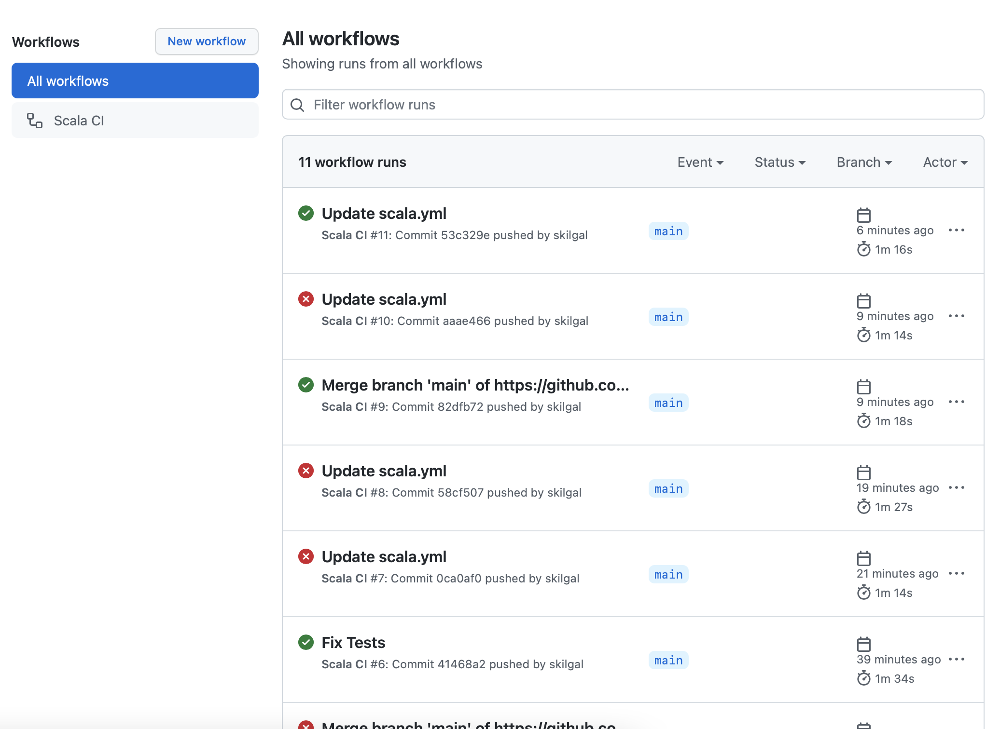
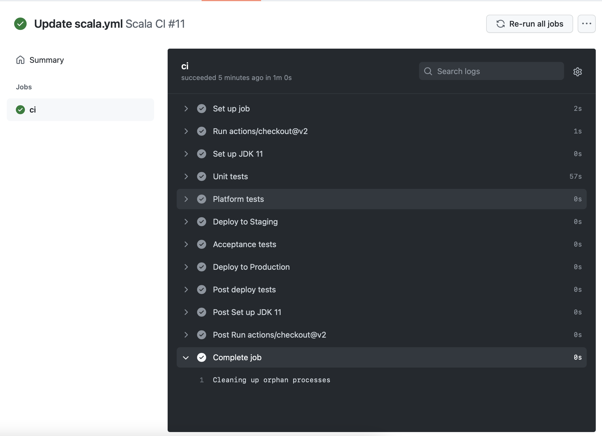

# Configure CI flow on GitHub Actions

1.  Have project repository

<https://github.com/skilgal/hermes>

1.  Create actions folder \`.github/workflows/\`

2.  Create flow \`scala.yml\`

    ``` yaml
    name: Scala CI

    on:
    push:
        branches: [ main ]
    pull_request:
        branches: [ main ]

    jobs:
    build:
        runs-on: ubuntu-latest

        steps:
        - uses: actions/checkout@v2
        - name: Set up JDK 11
        uses: actions/setup-java@v2
        with:
            java-version: '11'
            distribution: 'temurin'

        - name: Unit tests
        run: sbt test
        - name: Platform tests
        run: ./scripts/ci.sh "platform test"

        - name: Deploy to Staging
        run: ./scripts/ci.sh "deploy to staging"
        - name: Acceptance tests
        run: ./scripts/ci.sh "acceptance tests"

        - name: Deploy to Production
        run: ./scripts/ci.sh "deploy to production"
        - name: Post deploy tests
        run: ./scripts/ci.sh "test post-deploy"
    ```

# Check GitHub runs action no the push event




