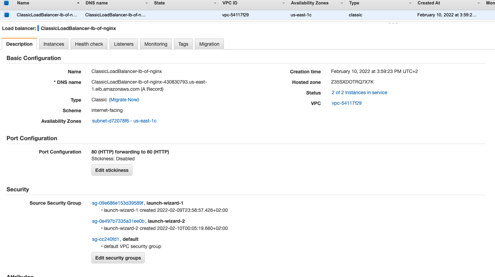
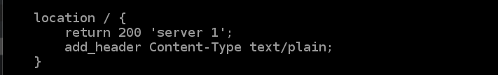
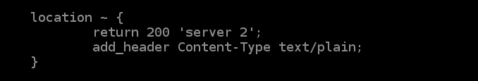
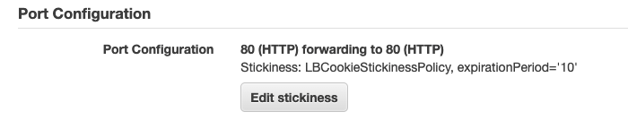

# Start 2 EC2 instances

Start 2 NGINX servers according to the official documentation
<https://www.nginx.com/blog/setting-up-nginx/>

# Start Load Balancer

## Description



## Instances

## Listeners

## Configure Nginx instances behind to separate them

### Instance 1



### Instance 2



# Test

## Without sticky sessions

All requests receive response from 1 and 2 nginx

``` shell
╰─$ http --session two -b ClassicLoadBalancer-lb-of-nginx-430830793.us-east-1.elb.amazonaws.com
server 1

╰─$ http --session two -b ClassicLoadBalancer-lb-of-nginx-430830793.us-east-1.elb.amazonaws.com
server 2

╰─$ http --session two -b ClassicLoadBalancer-lb-of-nginx-430830793.us-east-1.elb.amazonaws.com
server 1

╰─$ http --session two -b ClassicLoadBalancer-lb-of-nginx-430830793.us-east-1.elb.amazonaws.com
server 2

╰─$ http --session two -b ClassicLoadBalancer-lb-of-nginx-430830793.us-east-1.elb.amazonaws.com
server 1

╰─$ http --session two -b ClassicLoadBalancer-lb-of-nginx-430830793.us-east-1.elb.amazonaws.com
server 2

╰─$ http --session two -b ClassicLoadBalancer-lb-of-nginx-430830793.us-east-1.elb.amazonaws.com
server 1

╰─$ http --session two -b ClassicLoadBalancer-lb-of-nginx-430830793.us-east-1.elb.amazonaws.com
server 2
```

## With sticky sessions (by gened cookie for 10 sec)

Enable stickiness

 Send Request to the
LB

``` shell
# http - httpie client
# --session - save session: cookie and auth
# -b - show only body
http --session first -b ClassicLoadBalancer-lb-of-nginx-430830793.us-east-1.elb.amazonaws.com
```

``` shell
http --session first -b ClassicLoadBalancer-lb-of-nginx-430830793.us-east-1.elb.amazonaws.com
> server 1

http --session first -b ClassicLoadBalancer-lb-of-nginx-430830793.us-east-1.elb.amazonaws.com
> server 1

http --session first -b ClassicLoadBalancer-lb-of-nginx-430830793.us-east-1.elb.amazonaws.com
> server 1

http --session first -b ClassicLoadBalancer-lb-of-nginx-430830793.us-east-1.elb.amazonaws.com
> server 1

http --session first -b ClassicLoadBalancer-lb-of-nginx-430830793.us-east-1.elb.amazonaws.com
> server 1

http --session first -b ClassicLoadBalancer-lb-of-nginx-430830793.us-east-1.elb.amazonaws.com
> server 1

http --session first -b ClassicLoadBalancer-lb-of-nginx-430830793.us-east-1.elb.amazonaws.com
> server 1

http --session first -b ClassicLoadBalancer-lb-of-nginx-430830793.us-east-1.elb.amazonaws.com
> server 1

http --session first -b ClassicLoadBalancer-lb-of-nginx-430830793.us-east-1.elb.amazonaws.com
> server 1

http --session first -b ClassicLoadBalancer-lb-of-nginx-430830793.us-east-1.elb.amazonaws.com
> server 2

http --session first -b ClassicLoadBalancer-lb-of-nginx-430830793.us-east-1.elb.amazonaws.com
> server 2

http --session first -b ClassicLoadBalancer-lb-of-nginx-430830793.us-east-1.elb.amazonaws.com
> server 2

http --session first -b ClassicLoadBalancer-lb-of-nginx-430830793.us-east-1.elb.amazonaws.com
> server 2

http --session first -b ClassicLoadBalancer-lb-of-nginx-430830793.us-east-1.elb.amazonaws.com
> server 2

http --session first -b ClassicLoadBalancer-lb-of-nginx-430830793.us-east-1.elb.amazonaws.com
> server 2
```
