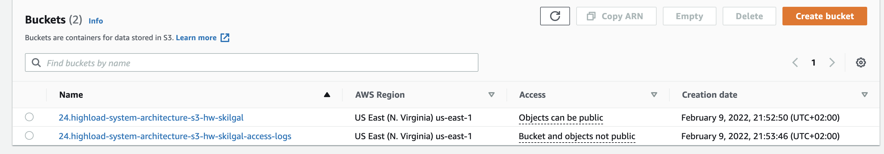
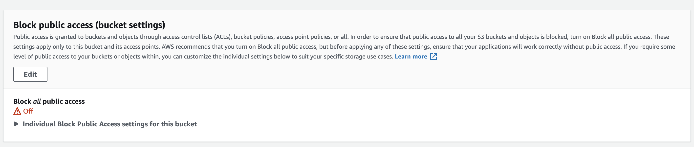
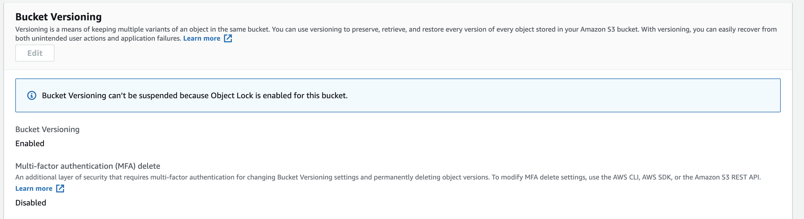
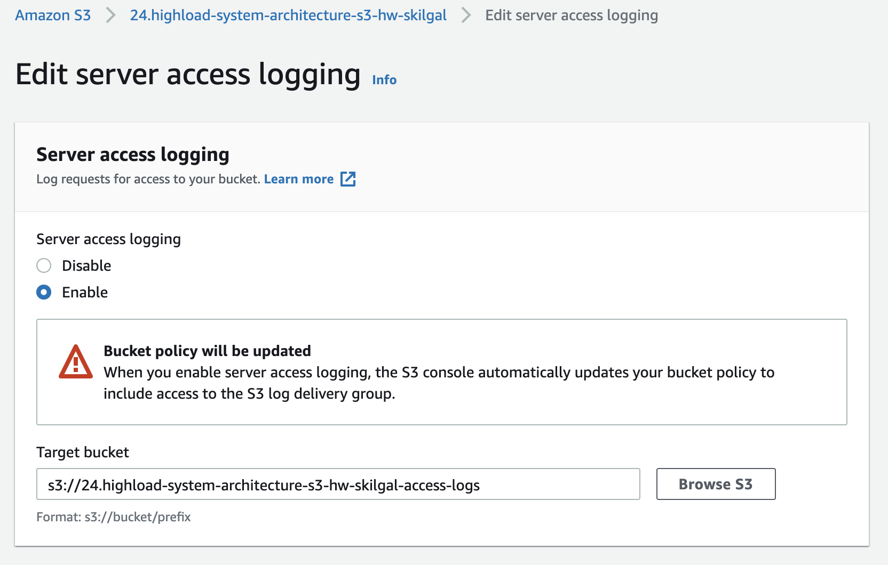
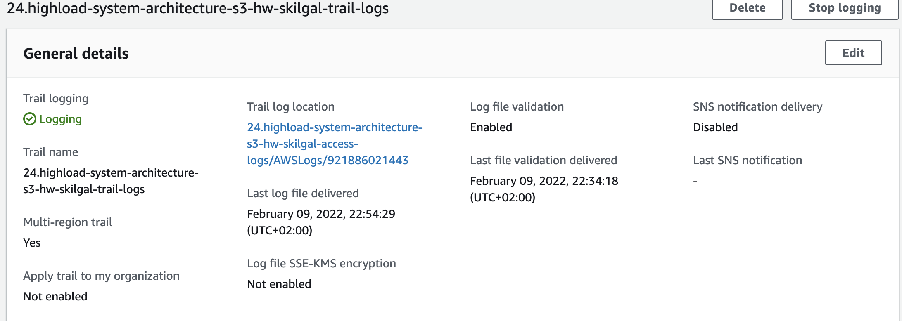
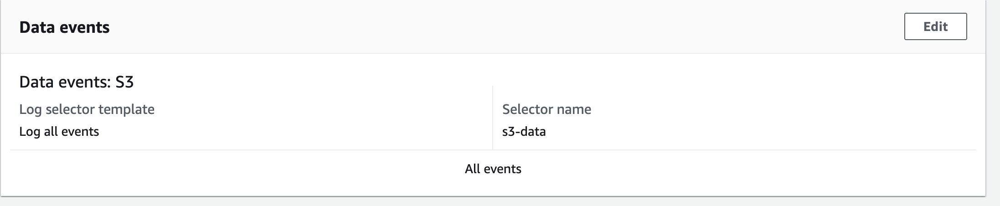
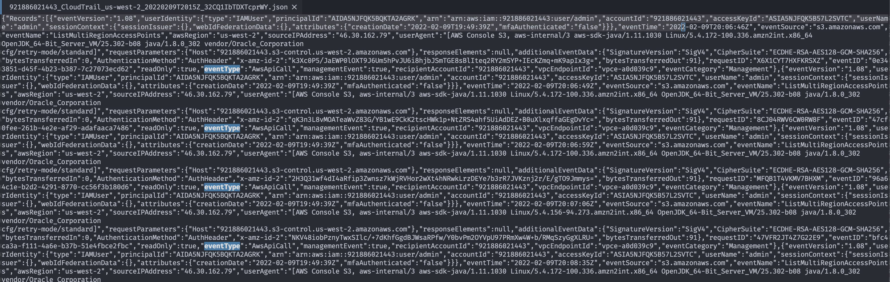
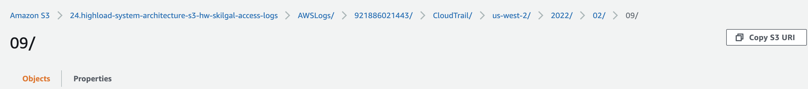

# Task

Create S3 bucket

1.  Bucket must be public
2.  Bucket must have WORM (Write Once Read Many) system
3.  Log all events of files inside bucket

# Checks

## Created

1.  Bucket \`24.highload-system-architecture-s3-hw-skilgal\` for all
    files
2.  Bucket \`24.highload-system-architecture-s3-hw-skilgal-access-logs\`
    for log storing

## Public bucket

## Configure WORM

## Configure Access logs to another bucket

Example of the log file [Access
Log.file](resources/2022-02-09-20-13-20-8610AE8671C89CF1.txt)

## Configure trail logs of events

### Configure Trail service

### Enable logging fol all events

### Trail logs example

Example of the trail log [trail
log](resources/921886021443_CloudTrail_us-west-2_20220209T2015Z_32CQ1IbTDXTcprWY.json)
