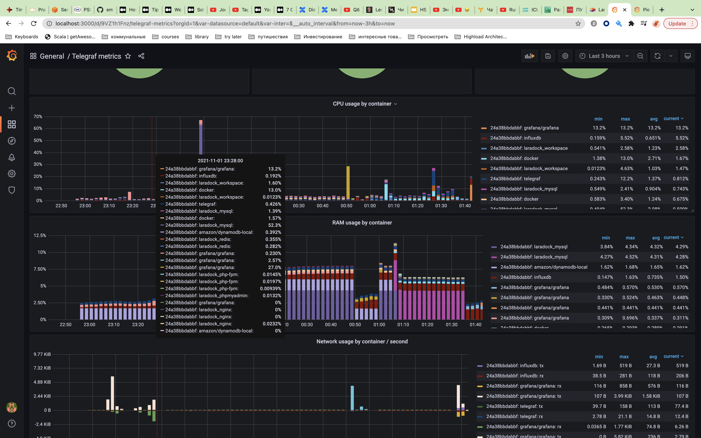
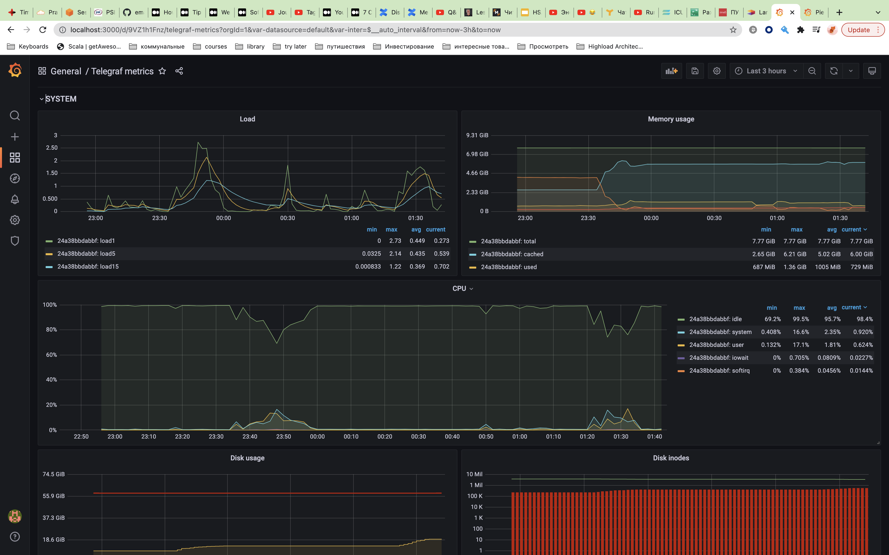
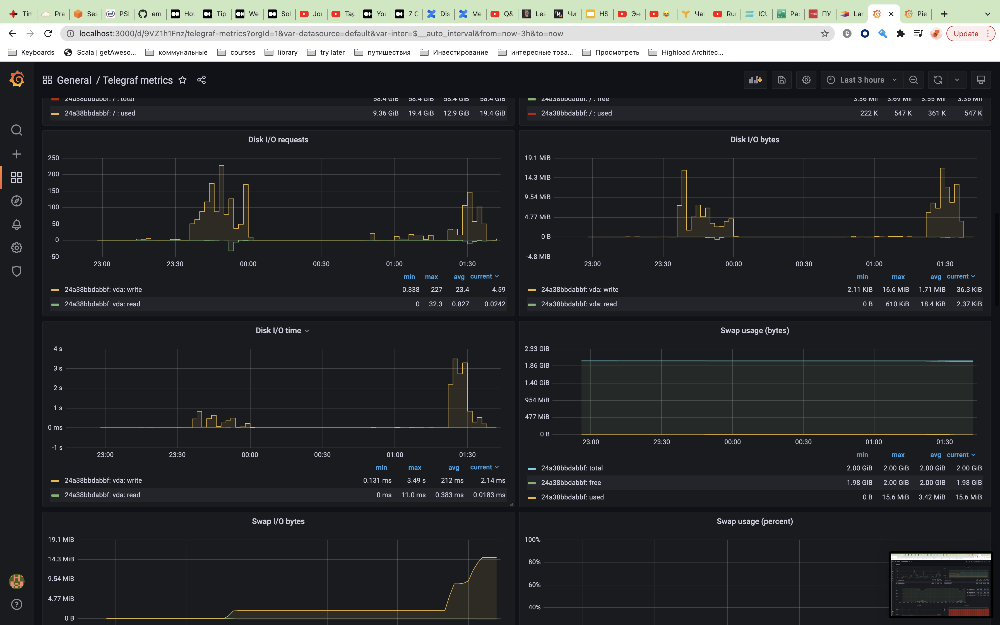
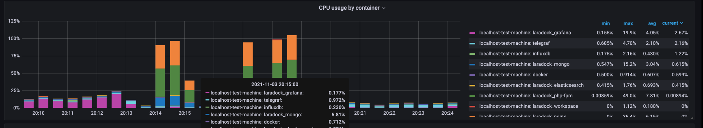
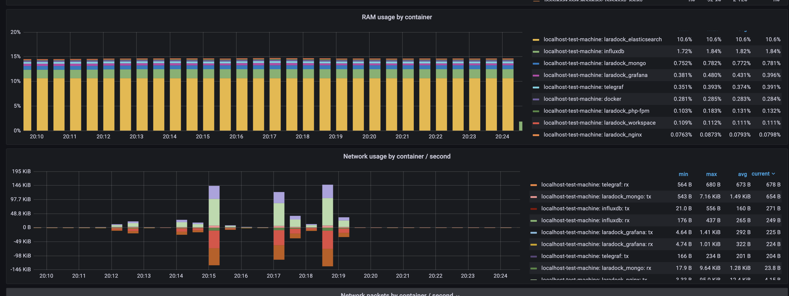
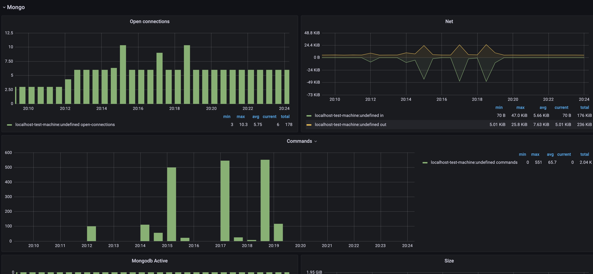
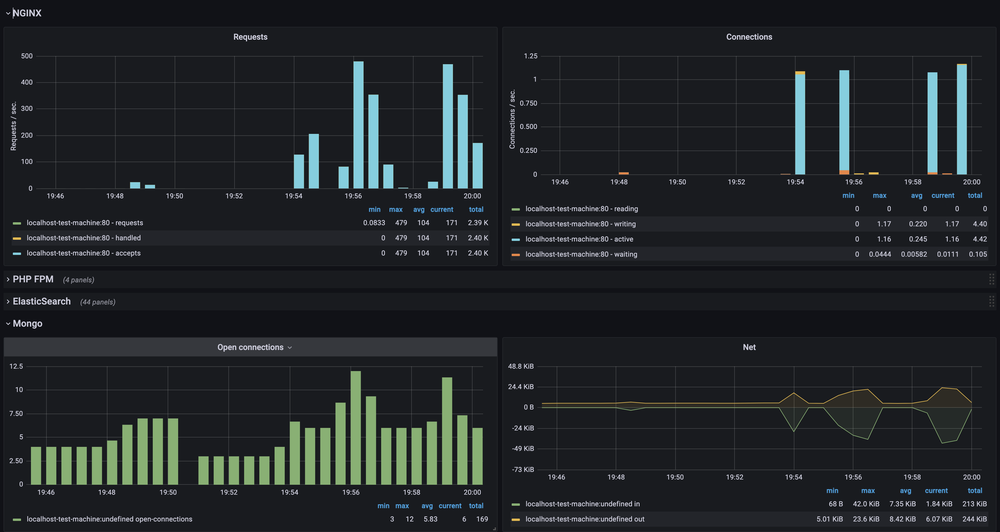
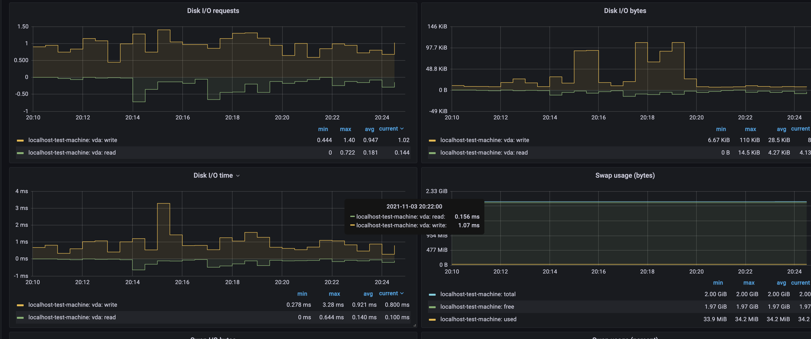
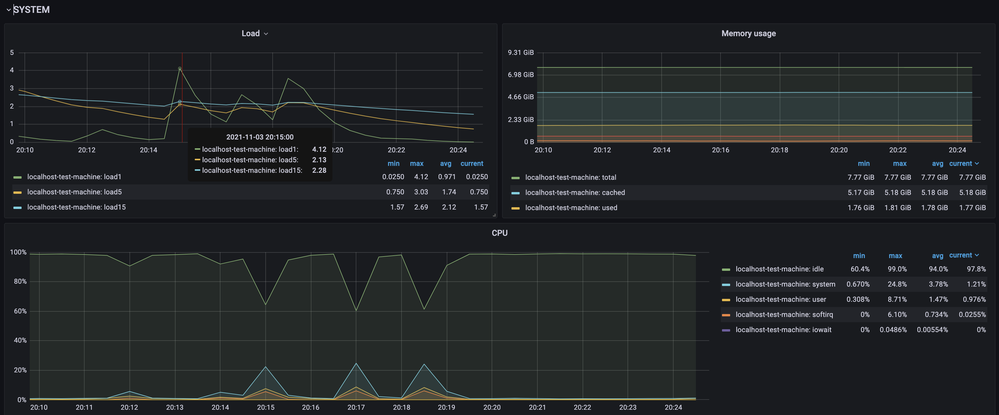

# Docker-compose files for a simple uptodate
# InfluxDB
# + Grafana stack
# + Telegraf

Get the stack (only once):

```
git clone https://github.com/nicolargo/docker-influxdb-grafana.git
cd docker-influxdb-grafana
docker pull grafana/grafana
docker pull influxdb
docker pull telegraf
```

Run your stack:

```
sudo mkdir -p /srv/docker/grafana/data
docker-compose up -d
sudo chown -R 472:472 /srv/docker/grafana/data

```

Show me the logs:

```
docker-compose logs
```

Stop it:

```
docker-compose stop
docker-compose rm
```

Update it:

```
git pull
docker pull grafana/grafana
docker pull influxdb
docker pull telegraf
```






Common testing flow via AB:

``` sh
./run.sh

sleep 10 && date && ab -n 30000 -c 20 http://localhost/ && sleep 10 && 
  date && ab -n 30000 -c 100 http://localhost/
```

On the result screen you can see common 2 spikes of the activity







